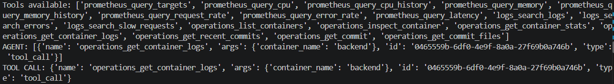
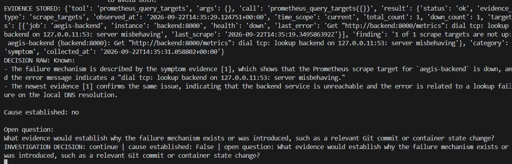
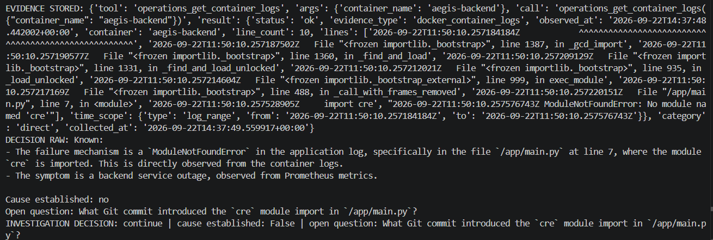
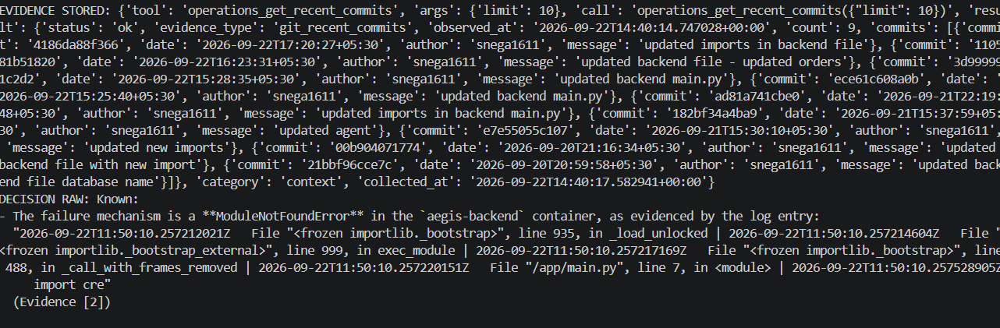

# 🛡️ Aegis AI SRE

**Evidence-Driven AI SRE Incident Investigation Agent**

Still Building !!!!!

Aegis is an AI-powered SRE incident investigation system that uses **LangGraph, MCP, local LLMs, RAG, Prometheus, Docker, Git, and NeMo Guardrails** to investigate infrastructure incidents through structured operational evidence.

The goal is simple:

> **Collect evidence first, then reason from the evidence instead of guessing the root cause.**

---

## 🎯 What Aegis Does

An engineer provides an incident ID.

Aegis retrieves the incident and investigates it using multiple operational sources:

```text
Incident
   ↓
LangGraph Agent
   ↓
MCP Tools
   ├── Prometheus → Metrics
   ├── Logs → Application evidence
   └── Operations → Docker + Git evidence
   ↓
Evidence State
   ↓
RAG Runbooks + Guardrails
   ↓
Investigation / RCA
```

The current project focuses primarily on **AI-driven investigation and evidence collection**. It does not automatically modify or remediate infrastructure.

---

# 🏗️ Architecture

```text
                    ┌──────────────────┐
                    │ Incident Database│
                    │   PostgreSQL     │
                    └────────┬─────────┘
                             │
                             ▼
                    ┌──────────────────┐
                    │   Aegis Agent    │
                    │    LangGraph     │
                    └────────┬─────────┘
                             │
              ┌──────────────┼──────────────┐
              ▼              ▼              ▼
          ┌────────┐    ┌────────┐    ┌────────────┐
          │ Ollama │    │  RAG   │    │   NeMo     │
          │ Qwen3  │    │Runbooks│    │ Guardrails │
          └────────┘    └────────┘    └────────────┘
                             │
                             ▼
                       ┌───────────┐
                       │ MCP Client│
                       └─────┬─────┘
                             │
              ┌──────────────┼──────────────┐
              ▼              ▼              ▼
        ┌──────────┐   ┌──────────┐   ┌────────────┐
        │Prometheus│   │   Logs   │   │ Operations │
        │   MCP    │   │   MCP    │   │    MCP     │
        └──────────┘   └──────────┘   └────────────┘
                                             │
                                      Docker + Git
```

Aegis is **containerized using Docker**, with the supporting application infrastructure running through containers.

---

# 🔌 MCP Investigation Tools

Aegis uses three MCP servers.

### Prometheus MCP

Provides:

* `query_targets`
* `query_cpu`
* `query_cpu_history`
* `query_memory`
* `query_memory_history`
* `query_request_rate`
* `query_error_rate`
* `query_latency`

Telemetry distinguishes between current and historical measurements.

### Logs MCP

Provides:

* `search_logs`
* `search_errors`
* `search_slow_requests`

Logs are sanitized before being exposed to the LLM, including basic secret redaction and line-length limits.

### Operations MCP

Provides Docker and Git investigation capabilities.

**Docker:**

* `list_containers`
* `inspect_container`
* `get_container_stats`
* `get_container_logs`

**Git:**

* `get_recent_commits`
* `get_commit`
* `get_commit_files`
* `get_commit_diff`

These tools allow Aegis to investigate runtime state and recent source-code changes.

---

# 🧠 Agent & Evidence State

LangGraph maintains the investigation state, including:

```text
messages
investigation_status
evidence
used_tools
tool_errors
investigation_summary
```

Collected evidence records the tool used, arguments, result, category, and collection time.

This gives the investigation a traceable evidence trail instead of relying only on the LLM's conversational memory.

---

# 📚 RAG

Aegis uses **Retrieval-Augmented Generation** with operational runbooks.

RAG provides investigation guidance based on the incident context, while live MCP tools provide evidence from the actual environment.

```text
Incident
   ↓
Relevant runbook
   ↓
Investigation guidance
   ↓
Live MCP evidence
```

---

# 🛡️ NeMo Guardrails

Aegis uses **NVIDIA NeMo Guardrails** to add deterministic controls around the AI investigation.

The system is designed to distinguish between:

```text
Observed problem
      ↓
Failure mechanism
      ↓
Supporting evidence
      ↓
Root cause
```

This helps reduce unsupported RCA or remediation claims.

---

# 🔐 Security

Aegis treats operational logs as untrusted input.

Basic protections include:

* Secret redaction
* Control-character removal
* Log-line length limits
* Structured tool outputs
* Evidence tracking

Common secret patterns such as `password`, `token`, `secret`, `api_key`, and `authorization` are redacted before model exposure.

---

# 🐳 Docker

Docker is used to containerize the project and its supporting infrastructure.

The Operations MCP server also provides read-only Docker runtime information to the agent, allowing it to inspect:

* Container state
* Container health
* Resource usage
* Container logs

---

# 🖥️ Interface

Aegis includes a Streamlit interface where an engineer can:

1. Enter an incident ID
2. Start an investigation
3. View incident information
4. Observe MCP investigation activity
5. Review collected evidence

---

# 📸 Screenshots

The following screenshots show actual outputs from the project.

### 1. Available Investigation Tools



`images/available-tools.png`

Shows the investigation tools exposed to the Aegis agent through MCP.

### 2. Prometheus Evidence



`images/prometheus-evidence.png`

Shows structured Prometheus telemetry collected during investigation.

### 3. Container Logs Evidence



`images/container-logs-evidence.png`

Shows container/application log evidence collected through the Operations MCP server.

### 4. Recent Git Commit Evidence



`images/recent-commit-evidence.png`

Shows Git history evidence collected during the investigation.

---

# 🛠️ Tech Stack

| Category            | Technology             |
| ------------------- | ---------------------- |
| Language            | Python                 |
| Agent orchestration | LangGraph              |
| LLM                 | Ollama / Qwen3 1.7B    |
| LLM framework       | LangChain              |
| Agent protocol      | MCP                    |
| MCP framework       | FastMCP                |
| Monitoring          | Prometheus             |
| Runtime             | Docker                 |
| Database            | PostgreSQL             |
| Source control      | Git                    |
| Knowledge           | RAG / Runbooks         |
| Guardrails          | NVIDIA NeMo Guardrails |
| UI                  | Streamlit              |

---

# 🚀 Future Improvements

* Stronger tool-selection evaluation
* Better tool-argument validation
* Larger reasoning models
* Automated RCA evaluation
* Improved RAG evaluation
* OpenTelemetry integration
* Cross-service incident correlation
* Controlled human-reviewed remediation

---

# 💡 Key Idea

Aegis is built around one principle:

> **The AI should assist the investigation; operational evidence should remain the source of truth.**

Instead of generating an explanation immediately, Aegis connects an AI agent to the systems that contain the evidence and uses MCP to make that evidence available during investigation.
